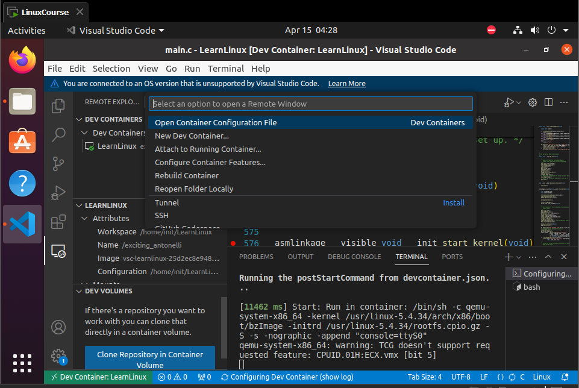
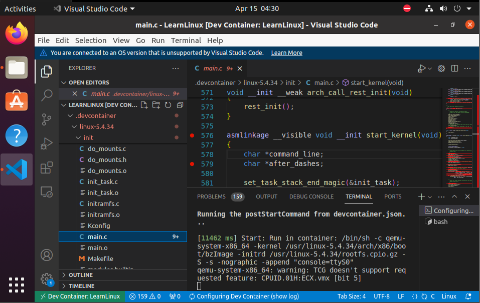

# LinuxKernel

linux-5.4.34可调试内核源码，基于vscode devcontainer

## 目录结构

-.vscode

-.devcontainer

  -linux-5.4.34

  Dockerfile

  devcontainer.json

## 项目依赖

docker、vscode和dev container插件

## 操作过程

1. 等待dev container创建完毕



2. 源代码中就能打断点调试



## 遇到的问题

1. failed to solve: failed to compute cache key: failed to calculate checksum of ref : "/linux-5.4.34": not found，**解决**：linux-5.4.34源代码需要放在.devcontainer文件夹里
2. 磁盘需要预留足够的空间，**解决**：命令行磁盘扩容

```shell
df -h
fdisk -l
# 注意，如果拓展分区已满需要先调整拓展分区再调整逻辑分区，拓展分区包含逻辑分区
sudo parted #进入分区磁盘的命令行，p打印信息，resizepart [id]扩容
sudo resize2fs [磁盘路径名] #刷新
```

